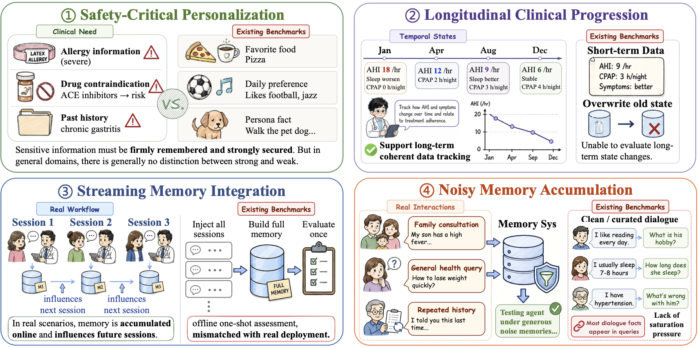

# MedMemoryBench: Benchmarking Agent Memory in Personalized Healthcare

<div align="center">
  
</div>

<p align="center">
  <em>Solving the issues of agent memory evaluation in healthcare scenarios.</em>
</p>

<p align="center">
｜🤗 <a href="https://huggingface.co/datasets/Cyan27/MedMemoryBench" target="_blank">HuggingFace Dataset</a> ｜
📄 <a href="#-citations">Preprint (Coming Soon)</a> ｜
🌐 <a href="README_ZH.md">中文</a> ｜
</p>

<p align="center">
  
  
  
</p>

---

**MedMemoryBench** is a benchmark framework for evaluating Agent memory methods, with a focus on memory capability assessment in medical dialogue scenarios. This framework provides unified evaluation interfaces, multiple baseline method implementations, and a flexible configuration management system, while also supporting the import and evaluation of other datasets.

## Table of Contents

- [News](#-news)
- [Features](#-features)
- [Project Structure](#-project-structure)
- [Quick Start](#-quick-start)
- [Configuration](#-configuration)
- [Output](#-output)
- [Citations](#-citations)

---

## 📰 News

- **[2026.05]** MedMemoryBench v1.0 is officially released — dataset, evaluation framework, and 16 memory method baselines.
- **[2026.05]** Dataset available on [HuggingFace](https://huggingface.co/datasets/Cyan27/MedMemoryBench).

## ✨ Features

<table>
<tr>
<td width="50%">

**Comprehensive Medical Dataset**
- 20 longitudinal patient personas with background, life events, and trap events
- ~2,020 multi-session doctor–patient dialogue sessions
- ~1,986 evaluation queries across 6 clinically motivated types
- Bilingual support: Chinese (~598 MB) + English (~443 MB)

</td>
<td width="50%">

**Rich Baseline Coverage**
- **3 classic baselines**: Long Context, Embedding RAG, BM25 RAG
- **5 agentic memory systems**: Mem0, Letta, Zep, MemOS, A-MEM
- **4 advanced RAG**: GraphRAG, HippoRAG, Self-RAG, MemoRAG
- **4 emerging methods**: MemRL, LightMem, ReMem, MIRIX

</td>
</tr>
<tr>
<td>

**Unified Evaluation Framework**
- Plug-and-play method integration via `BaseAgent`
- Multi-metric evaluation: string match + LLM-as-a-Judge
- Checkpoint & resume for long-running experiments
- Dry-run mode for fast pipeline validation

</td>
<td>

**Flexible Configuration**
- YAML-driven method & dataset configs
- Multi-provider LLM support (OpenAI / BigModel / Azure)
- Local & remote embedding models
- Cross-benchmark evaluation (MedMemoryBench + LoCoMo)

</td>
</tr>
</table>

## 📁 Project Structure

<details>
<summary>Click to expand full directory tree</summary>

```
MedMemoryBench/
├── main.py                       # Evaluation entry point
├── requirements.txt              # Python dependencies
├── LICENSE                       # Apache License 2.0
├── LEGAL.md                      # Comment-language legal notice
├── .env.example                  # Environment variable template
│
├── configs/                      # Configuration files
│   ├── method_config/            # Per-method YAML configs (gpt-5.1 / qwen3 variants)
│   │   ├── long_context_gpt-5.1.yaml
│   │   ├── embedding_rag_gpt-5.1.yaml
│   │   ├── bm25_rag_gpt-5.1.yaml
│   │   ├── graph_rag_gpt-5.1.yaml
│   │   ├── mem0_gpt-5.1.yaml
│   │   ├── memos_gpt-5.1.yaml
│   │   ├── memrl_gpt-5.1.yaml
│   │   ├── amem_gpt-5.1.yaml
│   │   ├── hipporag_gpt-5.1.yaml
│   │   ├── lightmem_gpt-5.1.yaml
│   │   ├── letta_gpt-5.1.yaml
│   │   ├── mirix_gpt-5.1.yaml
│   │   ├── remem_gpt-5.1.yaml
│   │   ├── zep_gpt-5.1-chat.yaml
│   │   └── ...                   # + qwen3 variants
│   └── dataset_config/
│       ├── medmemorybench.yaml
│       └── locomo.yaml
│
├── methods/                      # Memory method implementations
│   ├── base.py                   # BaseAgent abstract class
│   ├── long_context.py           # Long-context baseline
│   ├── embedding_rag.py          # Dense embedding RAG
│   ├── bm25_rag.py               # BM25 sparse RAG
│   ├── graph_rag.py              # Graph-based RAG
│   ├── self_rag.py               # Self-RAG
│   ├── mem0_agent.py             # Mem0 adapter
│   ├── memos_agent.py            # MemOS adapter
│   ├── memrl_agent.py            # MemRL adapter
│   ├── amem_agent.py             # A-MEM adapter
│   ├── hipporag_agent.py         # HippoRAG adapter
│   ├── lightmem_agent.py         # LightMem adapter
│   ├── letta_agent.py            # Letta adapter
│   ├── mirix_agent.py            # MIRIX adapter
│   ├── remem_agent.py            # ReMem adapter
│   ├── zep_agent.py              # Zep Cloud adapter
│   └── <vendored repos>          # mem0/, memOS/, MemRL/, amem/, HippoRAG/,
│                                 # LightMem/, letta/, MIRIX/, REMem/, MEM1/,
│                                 # cognee/, memorag/  (third-party sources)
│
├── benchmarks/                   # Dataset evaluation implementations
│   ├── base.py                   # BaseDataset abstract class
│   ├── medmemorybench/           # MedMemoryBench dataset
│   │   ├── dataset.py
│   │   ├── evaluator.py
│   │   └── checkpoint.py
│   └── locomo/                   # LoCoMo dataset
│       ├── dataset.py
│       └── evaluator.py
│
├── metrics/                      # Evaluation metrics
│   ├── base.py                   # BaseMetric abstract class
│   ├── string_match.py           # String matching metrics
│   ├── llm_judge.py              # LLM-as-a-Judge metrics
│   └── locomo_metrics.py         # LoCoMo-specific metrics
│
├── src/                          # Core orchestration modules
│   ├── config.py                 # Configuration loader
│   ├── agent.py                  # AgentManager
│   ├── evaluator.py              # Evaluation dispatcher
│   └── result.py                 # Result collection & reporting
│
├── utils/                        # Utility modules
│   ├── llm_client.py             # Unified LLM client
│   ├── tokenizer.py              # Tokenizer helpers
│   ├── templates.py              # Prompt templates
│   ├── prompts_qa.py             # QA prompts
│   ├── prompts_judge.py          # Judge prompts
│   ├── prompts_memorize.py       # Memorization prompts
│   ├── langchain_callback.py     # LangChain callback hooks
│   └── logger.py                 # Logger
│
├── docker/                       # Optional service compose files
│   ├── mirix-init.sql
│   └── mirix-services.yml
│
├── scripts/                      # Helper scripts
│   ├── run_eval.sh
│   └── mirix-services.sh
│
├── data/                         # Datasets (Git LFS)
│   ├── MedMemoryBench/           # Chinese, ~598 MB
│   ├── MedMemoryBench_EN/        # English, ~443 MB
│   └── locomo/                   # LoCoMo, ~18 MB
│
├── generation/                   # Dataset generation pipeline (sub-project)
├── outputs/                      # Evaluation outputs (gitignored)
├── exp_results/                  # Curated experiment reports
├── logs/                         # Runtime logs (gitignored)
└── results/                      # Method-side caches (gitignored)
```

</details>

## 🚀 Quick Start

### 1. Clone the Repository

> **Note:** This repository ships datasets via **Git LFS**. Please install it before cloning.

```bash
# Install Git LFS (skip if already installed)
brew install git-lfs                  # macOS
sudo apt-get install git-lfs          # Ubuntu/Debian
# Windows: https://git-lfs.github.com/

git lfs install
git clone https://github.com/AQ-MedAI/MedMemoryBench.git
cd MedMemoryBench
```

### 2. Environment Setup

<details open>
<summary><b>Using uv (recommended)</b></summary>

```bash
curl -LsSf https://astral.sh/uv/install.sh | sh

uv venv
source .venv/bin/activate          # Linux/macOS
# .venv\Scripts\activate           # Windows

uv pip install -r requirements.txt
```

</details>

<details>
<summary><b>Using conda</b></summary>

```bash
conda create -n medmemorybench python=3.10
conda activate medmemorybench
pip install -r requirements.txt
```

</details>

> **Method-specific dependencies:** Some memory methods vendor upstream packages under `methods/` (e.g. `methods/mem0/`, `methods/memOS/`). If a method has its own `requirements.txt` or `README`, follow those instructions to enable it.

> **Embedding models:** Method configs reference local embedding models under `models/`. Download before running:
> ```bash
> python -c "from sentence_transformers import SentenceTransformer; SentenceTransformer('BAAI/bge-small-zh-v1.5').save('models/bge-small-zh-v1.5')"
> ```
> You can also set `MODELS_DIR` to point to a custom models directory.

### 3. Configure Environment Variables

```bash
cp .env.example .env
```

Edit `.env` and fill in the API keys you intend to use:

```env
# BigModel (OpenAI-compatible, primary endpoint used in this project)
BIGMODEL_API_KEY=your_bigmodel_api_key
BIGMODEL_BASE_URL=https://open.bigmodel.cn/api/paas/v4

# OpenAI (optional)
OPENAI_API_KEY=your_openai_api_key
OPENAI_BASE_URL=https://api.openai.com/v1

# Azure OpenAI (optional)
AZURE_OPENAI_API_KEY=your_azure_key
AZURE_OPENAI_ENDPOINT=https://your-endpoint.openai.azure.com/

# Zep Cloud (optional, only needed for the Zep agent)
ZEP_API_KEY=your_zep_api_key

# Default model selection
DEFAULT_LLM_MODEL=gpt-4o-mini
DEFAULT_EMBEDDING_MODEL=text-embedding-3-small
EMBEDDING_PROVIDER=openai

# Optional: isolate Letta local runtime data (defaults to ~/.letta)
LETTA_DIR=.tmp/letta_runtime
```

> **Tips:**
> - For BigModel, set `BIGMODEL_API_KEY` / `BIGMODEL_BASE_URL` first; the framework maps them to OpenAI-compatible settings internally.
> - `LETTA_DIR` is recommended to avoid stale SQLite metadata from previous Letta runs.

### 4. Run Evaluation

**Via shell script:**

```bash
./scripts/run_eval.sh bm25_rag_gpt-5.1 medmemorybench
```

**Via Python:**

```bash
# Standard run
python main.py -m bm25_rag_gpt-5.1 -d medmemorybench

# Dry run (no real LLM/API calls)
python main.py -m embedding_rag_gpt-5.1 -d medmemorybench --dry-run

# Resume from checkpoint
python main.py -m embedding_rag_gpt-5.1 -d medmemorybench --resume
```

<!-- > 💡 **Extending with a new method?** See [`methods/README.md`](methods/README.md) for the step-by-step guide. -->

## 🔧 Configuration

### Method Configuration

Each method is driven by a YAML file under `configs/method_config/`:

```yaml
# configs/method_config/embedding_rag_gpt-5.1.yaml

method_name: "embedding_rag"
method_type: "rag"                  # baseline / rag / agentic_memory
description: "Embedding RAG Agent - Dense vector retrieval based RAG method"

model:
  provider: "openai"
  name: "gpt-5.1"
  temperature: 0.3
  max_completion_tokens: 100000

agent_params:
  top_k: 5                          # Number of documents to retrieve
  chunk_size: 512                   # Text chunk size
  chunk_overlap: 50                 # Chunk overlap

embedding:
  provider: "local"                 # openai / local / huggingface
  model: "/path/to/local/model"
```

### Dataset Configuration

Dataset configs live under `configs/dataset_config/`:

```yaml
# configs/dataset_config/medmemorybench.yaml

dataset_name: "medmemorybench"
description: "Medical dialogue memory evaluation dataset"
language: "zh"

data:
  root_dir: "data/MedMemoryBench"
  sessions_pattern: "persona_{id}/eval/generated_dialogues.json"
  queries_pattern: "persona_{id}/eval/generated_queries.json"

evaluation:
  mode: "independent"               # independent / merged
  evaluation_interval: 10           # Evaluate every N sessions

query_types:
  - name: "entity_exact_match"
    metric: "string_contain"
  - name: "temporal_localization"
    metric: "llm_judge"
  # ... more types
```

## 📄 Output

Evaluation results are saved under `outputs/<method>_<model>/`:

```
outputs/
└── bm25_rag_gpt-5.1/
    ├── eval_medmemorybench_20260330_181703.json    # Detailed results (JSON)
    ├── report_medmemorybench_20260330_181703.txt   # Human-readable report
    └── memory_builds_20260330_181703.json          # Memory build logs
```

## 📝 Citations

If you find MedMemoryBench useful in your research, please consider citing our work:

```bibtex
@article{medmemorybench2026,
  title={MedMemoryBench: Benchmarking Agent Memory in Personalized Healthcare},
  author={TODO},
  journal={arXiv preprint arXiv:XXXX.XXXXX},
  year={2026}
}
```

---

## 📜 License

- **Code** — [Apache License 2.0](LICENSE)
- **Dataset** (`data/MedMemoryBench/`, `data/MedMemoryBench_EN/`) — [CC BY 4.0](https://creativecommons.org/licenses/by/4.0/)
- **Vendored third-party sources** under `methods/` retain their original upstream licenses.
- See [LEGAL.md](LEGAL.md) for the source-comment language clause.
